# Introduction

Watching the biathlon world cup events on tv and sensing the thrill and
excitement of the athletes skiing and especially the shooting
performance, an idea of making a similar toy shooting range target
arrangement for nerf gun, was born.

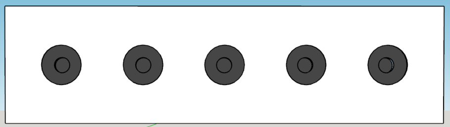

So, how to make this toy biathlon shooting range targets that can detect
a nerf gun dart bullet hit?

What technology could be used to register where a nerf gun dart bullet
have hit and what level of precision is needed?

The next thing the toy shooting range target arrangement will need a way
to tell the shooter if she or he has hit the target or not – for the
real biathlon shooting range target, this is done by mechanically
masking / covering the target hit with a white surface, hiding the
targets black surface.

In general, Piezoelectric elements are used to generate / produce sound
waves when a dc voltage is applied to the Piezo element’s terminals –
usually, a high, hearable, frequency sound.

Piezoelectric elements will also accumulate / generate electric charge
flow when exposed to mechanical stress of a certain amount. It is this
effect that can be used to register a nerf gun dart hit on a plane
target surface if the piezo element is mounted on this same target
surface.

Several simple experiments have shown that the signals from the
piezoelectric elements are sufficient for detecting the impulse a nerf
gun dart hit.

The following will describe the electronic and mechanical design for a
Biathlon Toy Target row, emulating the behaviour of the automatic target
hit indicator. Target hit indicator and reset function will be remote
monitored and controlled.

# Target hit indicator

A Nerf-gun dart bullet weighs about 1 g and have a max speed of ~20 m/s.
Guessing that the maximum speed will be some few milli seconds after
“firing” the Nerf-gun and thereafter the Nerf-gun dart bullet speed will
decline rapidly – a function that describe this would be nice.

The speed of the Nerf-gun dart bullet immediately before it hits the
target will determine the power of impact it will cause on the target
plate.

Without doing any advanced analysis of the physics involved, it is easy
to make a similar knock impact on a plane surface as if the same surface
was hit by a nerf gun dart bullet. For example, using a foot long ruler
or a medium size screwdriver, and hitting the plane surface with the end
of the ruler used as a drumstick.

Now, how should the hit sensor piezoelectric element be used? We need to
know more about the electrical characteristics of the piezoelectric
element and to learn about this, we’ll inspect its electrical behaviour
by use of an oscilloscope, when tapping it lightly, for example with end
of a pencil.

## Electrical properties of the piezoelectric element

The piezoelectric element used for this simple test / experiment, was a
1x1x1 cm in size and has two polarized SMD (surface mounted device)
terminals.

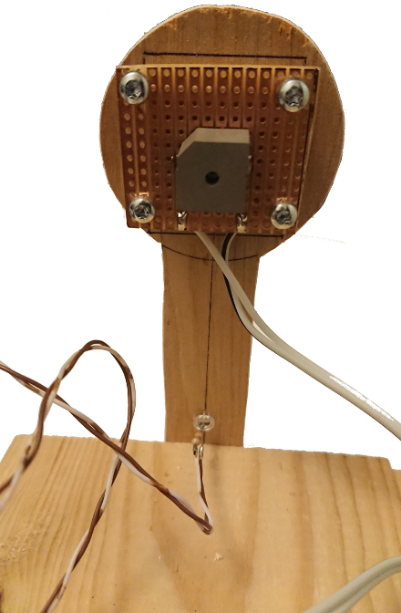

Figure : The piezoelectric element soldered to 3x3 cm Vero-board.

As seen in Figure 1, the terminals are connected to two wires, making it
easy to connect to the oscilloscope-probe. The Vero-board is mounted on
a small plywood contour as a 4.5 cm target to imitate a target for nerf
gun dart bullets. The target contour is screwed onto the edge of a board
for mechanical support.

When connected to the oscilloscope probe and taping the target contour
lightly with the one foot ruler, the following pulse train appeared on
the oscilloscope.

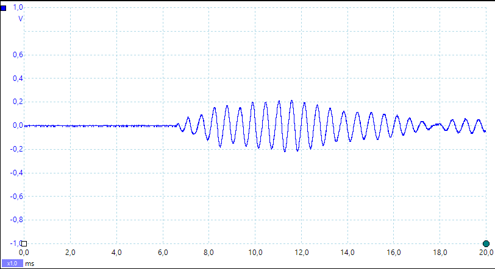

Figure 2: Piezo element mount and the pulse train developed by a medium
knock on the mount board.

The signal generated by the piezoelectric element show that it has an
alternating behaviour and for this impact it variates between –200mV and
+200mV. If the physical impact is greater, larger swing can be expected.
Harder impacts can generate up to 4 V peak-to-peak signal. The maximum
swing is not explored.

If the raw output from this piezoelectric element were to be used to
trigger an event, like an interrupt in a microcontroller, this output
signal will certainly challenge any microcontroller General Purpose IO
interface and even cause permanent damage to the interface.  
One trick to avoid this, would be to interconnect a 3v Zener-diode
between the piezoelectric element and the microcontroller GPIO
interface, but then the impact must be quite substantial to excide the
logical threshold for the GPIO interface, and must always be at the same
level of impact. This simple solution is unsuited for a system that
needs to detect a wide range of target hit impacts to allow for various
types of nerf-guns and variable shooting range.

So, to make use of piezoelectric element as target hit sensor, the
output must be refined and amplified, to comply with the requirement of
trigger a wide range of target hit impacts.

## Sensor circuit

Since the piezoelectric element produces an alternating signal, the
signal needs to be rectified and smoothened so that it represents a
single positive pulse. This signal manipulation is usually called “peak
detection”, which is a method to find the highest pulse value among a
series of variable sized pulses.

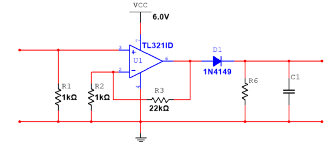

Figure : Simple peak detector using an Operational Amplifier.

As this piezoelectric signal will need to be amplifies, it is sensible
to use an Operational Amplifier together with the circuit elements (D1,
C2 & R6) that make the peak detector.

Since the microcontrollers GPIO interface in general accepts only
positive voltages and uses 0V as ground reference, it is most practical
to use a single supply Operational Amplifiers and use supply voltage for
the OpAmps suitable for the MCUs GPIOs.

To detect target hit with variable impact, the rectified and smoothened
signal from the piezoelectric element is forwarded to a level
comparator. The comparator will output Vcc if the input signal from the
peak detector is higher than a reference level, and output 0V if the
input signal is lower than this reference level.

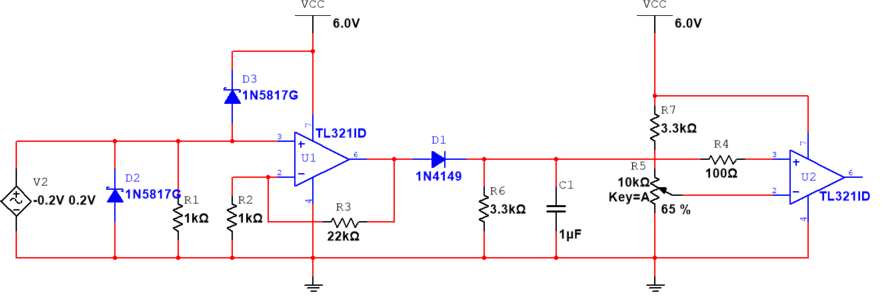

Figure : Super simple peak detector followed by a mid-level comparator
to produce a 5V hit trigger/interrupt signal (max outupt is VCC – 1V =
5V according to the data sheet for TL321).

The target hit detector is simple and can be implemented on a small,
printed circuit board, which is easily mounted on the backside of a
piece of 4 to 6 mm plywood, where the frontside of the plywood piece, is
the target to hit.

The impact on the target plate will propagate to the piezoelectric
element soldered onto the PCB, which will produce a single pulse that
can trigger an event on an MCU.

# Detector Hardware solution

The Nerf gun bullet dart hit detector circuit design is manufactured as
a 30x30mm PCB by use of the free CAD tool KiCad. The PCB design
documents are part of the BiathlonToyTargets git repository.

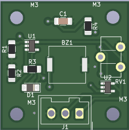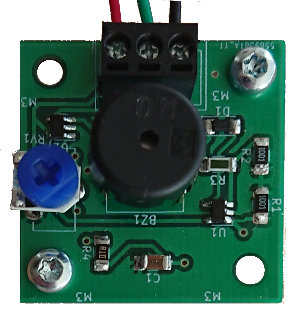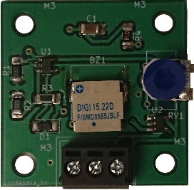

Figure : PCB for the target hit detector. The rightmost uses a surface
mounted piezo element.

# Target hit indication

The shooting range biathlon targets indicate immediately if one is hit,
by covering the black surface that represents the target. To imitate
this functionality, a small servo motor will rotate a circle shaped 3 mm
MDF plate, called the Cover-plate, between the target surface and the
front plate.

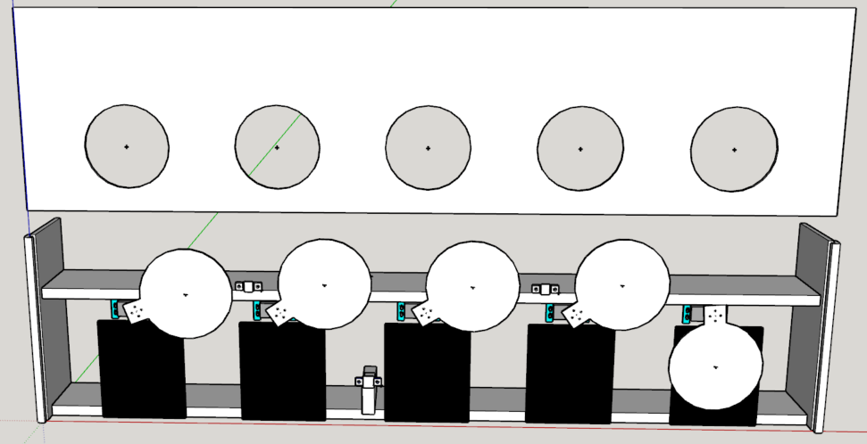

Figure : The construction of the biathlon toy target stand.

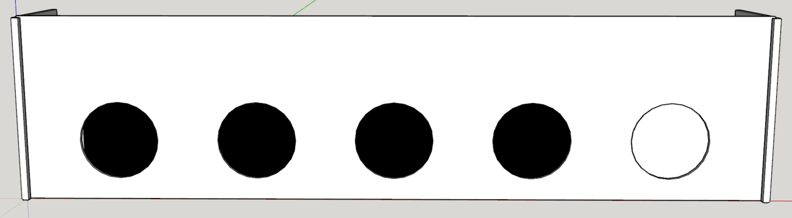

Figure : The biathlon toy targets with one hit indication - the
rightmost target surface is covered by its cover plate.

## Shooting range biathlon toy targets construction

The biathlon toy targets stand with cover plates for hit indication, is
a simple construction made from 16 mm floorboards of fir tree and a 6 mm
plywood target stand cover with 5 circular formed “windows” exposing the
biathlon toy target surfaces.

From Figure 5, two floorboards form as top end bottom of the
construction, providing support for both the target surface for the nerf
gun dart bullets (the lower floorboard), and for mounting the servo
motors for each hit indicator cover plate. The cover plate is attached
to the servo motors spine shaft by a spine socket fixture to rotate it
to cover the target “window”.

## Servo motor requirements

The servo motor must be able to rotate the target cover, meaning that it
has to provide sufficient torque for this operation. The size and weight
of the target cover determines the necessary torque needed.  
As the biathlon standing target diameter is 11.5 cm, the target cover
must have a slightly larger diameter and a diameter of 13 cm will
probably be a practical size. Alternative materials can be used, but for
the current prototype, 3 mm MDF board will be used. This material’s
density is approximately 820 kg/m3, which gives that MDF
target cover described above will weigh approximately …..

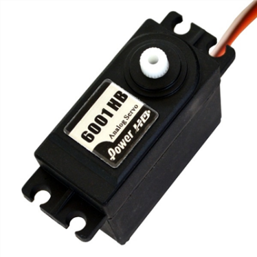

Figure 8: Servo motor (<https://www.elefun.no/p/prod.aspx?v=15938>) to
move the target cover. The 6 mm plywood target cover can and will be
replaced with 3 mm MDF material.

The volume of the target cover = d·πr2 = 0.003 m · π · (0.065
m)2 = <u>12.68 · 10-6 m3</u>

- The total weight of the target cover is approximately **33 grams**.

- Centre of mass relative to servo shaft (13 cm/2 + 1 ∽ **7.5 cm**)

- Required servo torque = 33g \* 7.5 ~ **0,25 kg/cm**

So, using an analogue that outputs a torque of 6.7 kg / cm would
certainly be more than sufficient, which the Power HD-6001HB will do.

## Servo motor control and operation

In general, servo motors are controlled by a 50 Hz PWM signal, usually
provided by a microcontroller. The servo motor’s interface contains of
6V and Ground connection in addition to the PWM signal wire.

# Solution infrastructure

The biathlon toy target solution infrastructure is shown in …

Figure 9: Biathlon toy target hardware infrastructure for automatic hit
detection and indication.

# Wiring plan

Every target will need power and two signal leads. The power will be
distributed from a 6V battery pack onto a power bus that is connected
(some daisy chained) five individual connection panels.

Each of these connection panels will then provide power to both target
sensor elements and the servo motor. The signal leads from the sensor
and to the servo will also be connected this connection panel and wired
to the proper GPIO on the MCU.

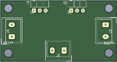

Figure : Power and signal distribution.

Important to supply each power connection with an appropriated sized
capacitor for stable power source for the hit sensor circuits.

# Microcontroller considerations

The construction of the prototype Biathlon Toy Targets with automatic
hit detection and indication, will so far need a microcontroller that
has at least 10 General Purposed IO ports for handling the shooting
situation. The Biathlon Toy target system must also have a way of
resetting the target covers, preferable from a distance, in addition to
reading the hit results digitally and forward these to another device or
computer. A possible option for this last requirement could be to use a
simple UART, which is often included in microcontrollers.

## Interrupt driven operation for hit detection

Since there are 5 targets that can be hit in any order, the hit sensor
should trigger on an interrupt that reads the signal status on all
targets simultaneously to determine which has been hit. This
functionality will require that 5 of GPIOs, in the selected MCU, used
for hit-detection, must have the ability to trigger an interrupt based
on a signal level change.

## PWM driver for hit indication

The servo motor will tbd

## Wireless and/or wired communication for reset, collecting results and test functions

The easiest way of implementing a communication channel between the MCU
and a PC is to use the legacy serial port operation, since this is based
on the UART functionality, which is also often found integrated in many
microcontrollers.

Implementing the bi-directional operation of this functionality,
commands can be given from a remote terminal, like reset target covers,
and feedback can be received for both hit results and debugging needs.

# Microcontroller used for the Biathlon Toy Target prototype

The MCU used for the Biathlon Toy Target is a 8-bit mcu Attiny 1634 from
Microchip. This is tiny device with 18 programmable IO pins, 16k flash
memory and 1k random access memory, which is more than sufficient to
implement the necessary software operations for the prototype Biathlon
Toy Targets with automatic hit detection and indication.

## Integrated Development Environment – Atmel Studio 7.0

Programmer and debugger… Atmel Ice

# Remaining work on the prototype.

1)  Arranging all loose wires onto the target structure by use of cable
    clips or glue.

2)  Make passage for the wires in wood structure.

3)  Glue spacer (3 mm MDF) onto the centre of the target cover servo
    mount point…

4)  Clue spacer (4 or 3 mm MDF) onto the centre of the back of the
    target cover for mechanical support it shot at when it covers an
    already hit target.

5)  Make an open panel for mounting power jack for charging the battery
    pack, a toggle switch for power on/off the unit.

6)  Make a Veroboard for connecting the power jack and power switch the
    MCU and battery pack.

7)  Solder a 10µF capacitor to all sensor and servo power distribution
    boards.

8)  Test functionality with a new improved front board centre “clamping”
    (this is to make the front board as straight as possible)

9)  <u>IMPROVEMENT</u>: Use the analogue input to measure the battery
    voltage and show it through a terminal command.
